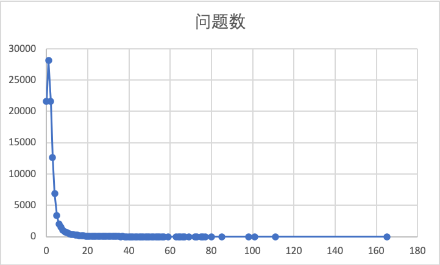

## 中文心理问答数据集  
Chinese Psychological QA DataSet


### 20200505
102845 条社区问答对
示例数据
```  json
{
        "ques_id": "eccbc87e4b5ce2fe28308fd9f2a7baf3",
        "ques_info": {
            "title": "纠结～求助！，我想我心理不正常了…",
            "content": "lz最近喜欢一个男的，因为在大学社团一起工作，很迷恋，他的幽默风趣，他的踏实稳重… \r\n重点是！我现在有对象，因为大一的时候和高中的对象分了后随便找的一个，不是很喜欢也不是很讨厌的那种，只是不喜欢一个人那么寂寞… \r\n重点是！我现在喜欢的男的也有对象，据打听也是刚在一起的… \r\n很久都没有那么喜欢一个人了，以为自己再也找不到这种感觉了，现在满脑子都是他，也不知道该怎么面对我现在的对象了…哎，我怎么可以这",
            "answer_count": "1",
            "reward_num": -1,
            "ques_label": [
                "婚姻"
            ]
        },
        "staic_info": {
            "hug": "0",
            "collect": "0",
            "reply": "1个回答"
        },
        "answers_info": [
            {
                "recommend_flag": "不推荐",
                "content": "我想只是一种好感喔 我以前和前任在一起我也有喜欢一个男生 心理上单纯的喜欢 对方也有女友 是那种知道不可能一起但默默喜欢 也纠结我好久。所以我想你应该是一样 还有 如果还是不那么喜欢你男友的话不妨考虑清楚？不要为了寂寞就一起 也不能伤害他呀。纯粹建议\n",
                "zan": "0",
                "shang": "0",
                "comment_count": "0"
            }
        ]
    },
```
### 数据解释

|key| 解释|
|----|----|
|ques_id| 问题id|
|**ques_info**| 问题信息|
|title| 问题标题|
|content|问题详细内容|
|answer_count| 答案数量|
|reward_num|悬赏金额|
|ques_label|问题标签|
|**static_info**|统计信息|
|hug|给提者安慰的数量|
|collect|收藏问题数|
|reply|回答数 同answer_count|
|**answer_info**|答案信息|
|recommend_flag|是否推荐此答案|
|content|答案内容|
|zan|收到的赞同数|
|shang|收到的打赏数|
|comment_count|评论数|


### 数据统计
回答数与所对应的问题数  

